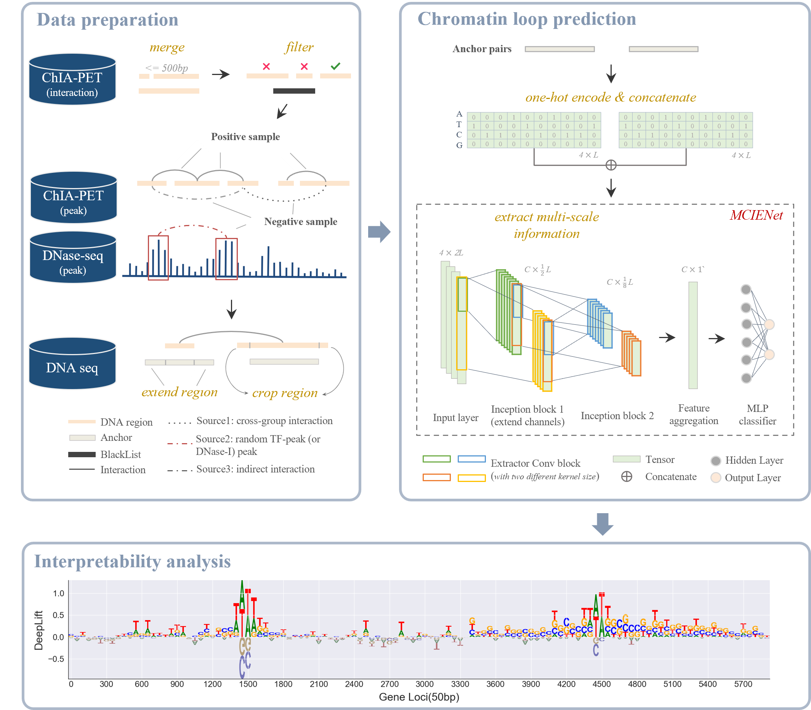

# MCIENet
MCIENet: Multi-scale CNN-based Information Extraction from DNA Sequences for 3D chromatin interactions Prediction



# get started
## step 0. clone the repository
```shell
git clone https://github.com/aaron-ho/MCIENet.git
```

## step 1. setup environment
### 1. use docker
> **you may need to Install  `docker` and `docker-compose` first**


Create and enter the container
```shell
# Build and start the container (in background)
docker-compose -f docker/docker-compose.yml up -d

# Enter the container
docker-compose -f docker/docker-compose.yml exec mcienet /bin/bash

# You can now use MCIENet in the command line ...
```
exit and remove the container

```shell
# To exit the container
exit

# To stop and remove the container
docker-compose -f docker/docker-compose.yml down
```
Useful Commands
- `pause`: Temporarily freeze container state for quick resumption
- `stop`: Gracefully stop the container and release resources
- `down`: Stop and remove containers

### 2. use scripts
Scripts is under `scripts/set_env`, you can use it to setup the environment.
- `set-env_conda`: set up conda environment for MCIENet
- `set-env_venv`: set up venv environment for MCIENet
- `set-env_dnabert`: set up conda environment for dnabert

> **note**: these scripts just for reference, you need to customize your environment path in the script.  

## step 2. generate train data
**First, you need to make sure you are in the docker container or activated the environment**

This project uses pre-processed data located in the `data/proc/` directory. The pre-processing steps have already been completed for the example dataset.

### Data Structure
- Raw data: `data/raw/` - Contains the original input files (e.g., BED, BAM, FASTA files)
  - **Important**: You need to download the hg19 reference genome (hg19.fa) from [UCSC](https://hgdownload.soe.ucsc.edu/goldenPath/hg19/bigZips/) and place it in this directory before running the scripts.
- Processed data: `data/proc/` - Contains pre-processed data ready for training
- Training data: `data/train/` - Will contain the final training data generated from processed data

### Processing Your Own Data
If you want to process your own data, you can:
1. Place your raw data in the `data/raw/` directory
2. Refer to the scripts in `scripts/1_get_neg-pos_data/` for examples of how to:
   - Process raw data into the required format
   - Generate positive and negative sample pairs
   - Prepare the data for training

For this tutorial, we'll use the pre-processed data in `data/proc/gm12878_ctcf` to generate the training data in `data/train/gm12878_ctcf`.


```shell
scripts/2_generate_traindata/gm12878_ctcf/Linux/1000bp.onehot.sh
```

after the script is done, you will find the train data in `data/train/gm12878_ctcf/1000bp.50ms.onehot/data.h5`.

> **note**: this proccess need at least 4GB memory. here is example scripts for 1000bp, when we use 2000 or 3000 bp as anchor size, we need more memory.

## step 3. train
### BaseCNN
```shell
scripts/3_train/example/BaseCNN.sh
```

### MCIENet
```shell
scripts/3_train/example/MCIENet.sh
```

## step 4. XAI
we can use the model we already trained under `output\best` as the model path.

Here we use DeepLift as the XAI method, you can also use other methods like LIME, SHAP, etc. Details arguments can be found in `get_attr.py`.

### BaseCNN
```shell
python get_attr.py \
    --model_folder "output/best/BaseCNN-gm12878.ctcf-1kb" \
    --output_folder "output/XAI/BaseCNN-gm12878.ctcf-1kb" \
    --data_folder "data/train/gm12878_ctcf/1000bp.50ms.onehot" \
    --phases train val test \
    --batch_size 500 \
    --method "DeepLift" \
    --crop_center 500 \
    --crop_size 1000 \
    --use_cuda True
``` 

### MCIENet
```shell
python get_attr.py \
    --model_folder "output/best/MCIENet-gm12878.ctcf-1kb" \
    --output_folder "output/XAI/MCIENet-gm12878.ctcf-1kb" \
    --data_folder "data/train/gm12878_ctcf/1000bp.50ms.onehot" \
    --phases train val test \
    --batch_size 500 \
    --method "DeepLift" \
    --crop_center 500 \
    --crop_size 1000 \
    --use_cuda True
``` 

> **note**: more example scripts can be found in `scripts\4_XAI\Linux`.

# Reference
- _Cao, Fan, et al. "Chromatin interaction neural network (ChINN): a machine learning-based method for predicting chromatin interactions from DNA sequences." Genome biology 22 (2021): 1-25. https://doi.org/10.1186/s13059-021-02453-5._
  - Github: https://github.com/mjflab/chinn
- _Zhou, Zhihan, et al. "Dnabert-2: Efficient foundation model and benchmark for multi-species genome." arXiv preprint arXiv:2306.15006 (2023). https://doi.org/10.48550/arXiv.2306.15006._
  - Github: https://github.com/MAGICS-LAB/DNABERT_2
  - Pretrain model: https://huggingface.co/zhihan1996/DNABERT-2-117M

# Citation

This version of implementation is only for learning purpose. For research, please refer to  and  cite from the following paper:
```
@inproceedings{ MCIENet,
  author = "Yen-Nan Ho and Jia-Ming Chang"
  title = "MCIENet: Multi-scale CNN-based Information Extraction from DNA Sequences for 3D chromatin interactions Prediction",
  booktitle = "",
  pages = "",
  year = "2025",
}
```
